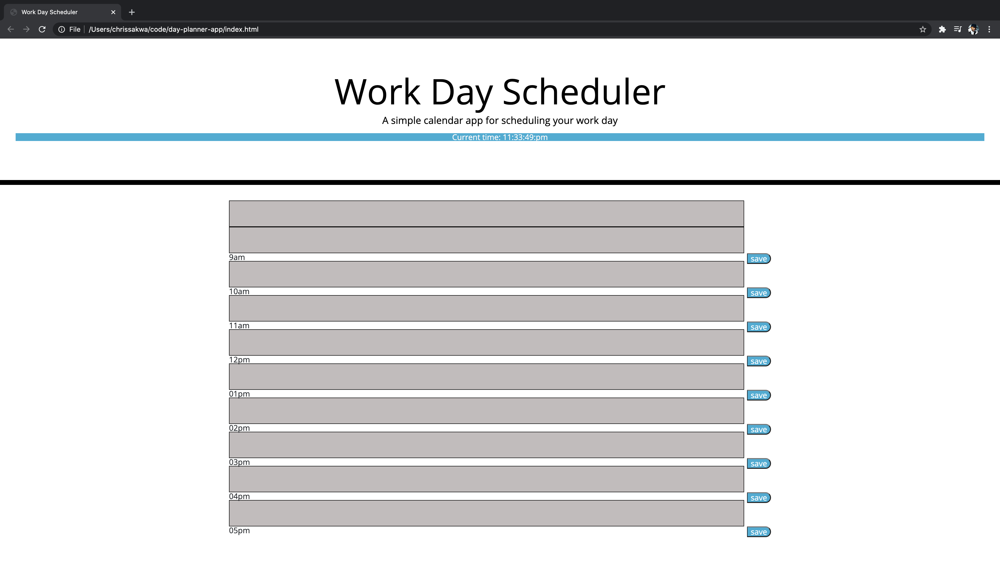

# day-planner-app
The purpose of this program is to help users easily organize and record their daily tasks by hour throughout the day. The program has a tab at the top of the page that shows current time. This is to enhance the user experience by providing a live time reference.

## Technologies
Technologies used in this program are HTML, CSS and Javascript

## Homepage Screenshot

## URL of deployed site
https://ckomodo.github.io/day-planner-app/
## Author
Chris Sakwa Wesonga is a full stack web developer in Seattle, WA. Twitter: @slimsakwa Github: github.com/ckomodo